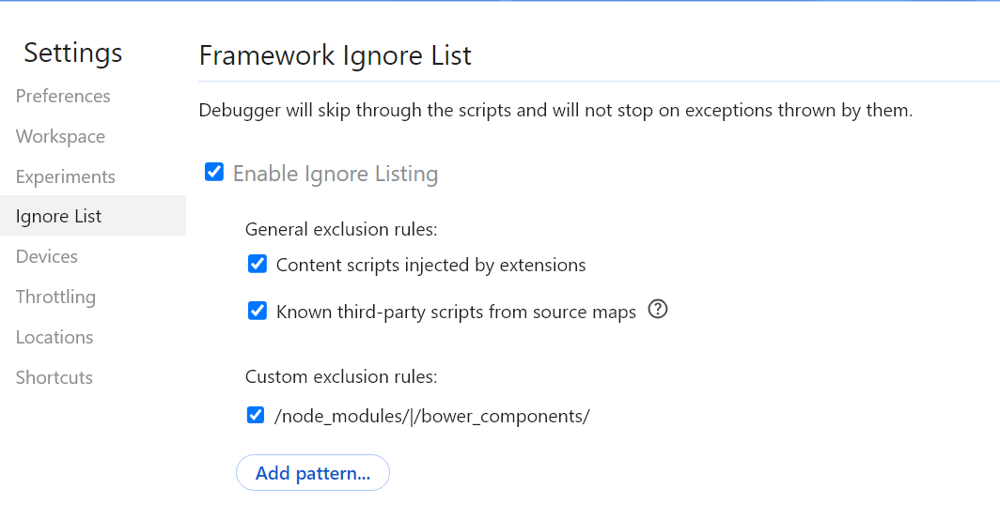

# JavaScript Debugger Bypass

# 一、这是什么


- 关闭所有断点
- 一律不在此处暂停
- 增加条件断点 
- Hook修改上下文（本工具做的事）
- 修改响应文件 


# 二、已经测试的网站

已通过测试的网站：

- https://www.4399.com/flash/18012.htm
- https://www.nmpa.gov.cn/datasearch/home-index.html#category=ylqx

Chrome浏览器的忽略断点功能： 




编译：

```bash
npm run build
```

开发的时候热编译：

```bash
npm run watch
```

在油猴脚本增加一个本地：
```javascript
// ==UserScript==
// @name         js-debugger-bypass
// @namespace    https://github.com/JSREI/js-debugger-bypass.git
// @version      0.0.1
// @description  用于拦截掉网页上的无限debugger断点
// @document     https://github.com/JSREI/js-debugger-bypass.git
// @author       CC11001100 <CC11001100@qq.com>
// @match        *://*/*
// @run-at       document-start
// @require      file:///Users/cc11001100/github/jsrei/js-debugger-bypass/dist/index.js
// ==/UserScript==
(() => {

})();
```

把`file:///Users/cc11001100/github/jsrei/js-debugger-bypass/dist/index.js`修改为编译后的index.js在你本地硬盘的路径。


